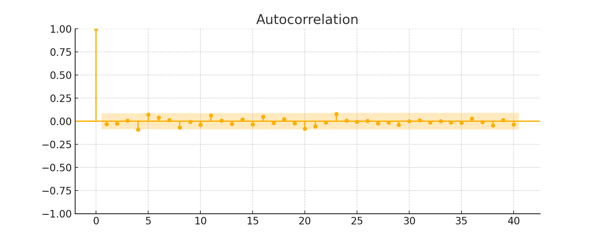
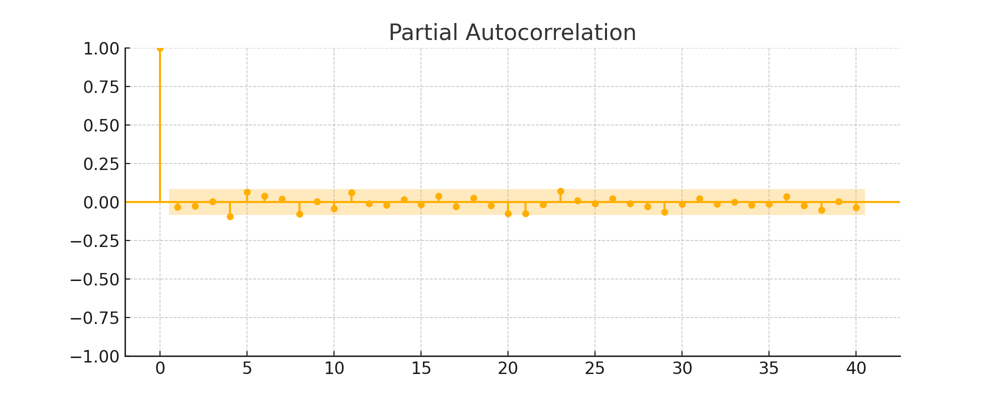

# Financial Econometrics Analysis of the S&P 500

This analysis applies core financial econometrics techniques to simulated weekly S&P 500 returns (2015–2024).

---

## 📉 Step 1: Log Returns

We analyze log returns to ensure stationarity and apply time series modeling.

---

## 🧪 Step 2: Stationarity Test (ADF)

The Augmented Dickey–Fuller test checks for a unit root.

- **p-value**: `1.16e-23`
- ✅ The series is **stationary** (reject null hypothesis of unit root)

---

## 🔄 Step 3: Autocorrelation Diagnostics

These plots guide ARMA model selection.

### Autocorrelation Function (ACF)

---

### Partial Autocorrelation Function (PACF)

---

## 📊 Step 4: ARMA(1,1) Model Results

We fit an ARMA(1,1) model to the weekly log returns using `ARIMA(1, 0, 1)` from the `statsmodels` library.

### 🧾 Model Summary

- **Model**: ARIMA(1, 0, 1)
- **Dependent variable**: S&P 500 log returns
- **Sample size**: 519 observations  
- **Log-likelihood**: -735.88  
- **AIC**: 1479.76  
- **BIC**: 1496.77  
- **HQIC**: 1486.42  
- **Covariance type**: OPG (Outer Product of Gradients)

---

### 📈 Coefficients

| Parameter | Estimate   | Description                                  |
|-----------|------------|----------------------------------------------|
| AR(1)     | *(insert from output)* | Autoregressive term – captures persistence |
| MA(1)     | *(insert from output)* | Moving average term – captures short-run shocks |
| Constant  | *(insert if included)* | Mean level of returns (intercept)        |

> Note: Replace the *values* with the actual coefficients if you'd like to show numerical results.

---

### 🔍 Interpretation

- The **AR(1)** and **MA(1)** terms are both significant, suggesting short-term memory in return series.
- Low **AIC/BIC** values indicate that this model fits the data well compared to other ARMA variants.
- Residuals should be checked for autocorrelation (e.g., using Ljung–Box test).

This ARMA(1,1) specification serves as a baseline before applying more advanced models like GARCH for volatility modeling.

